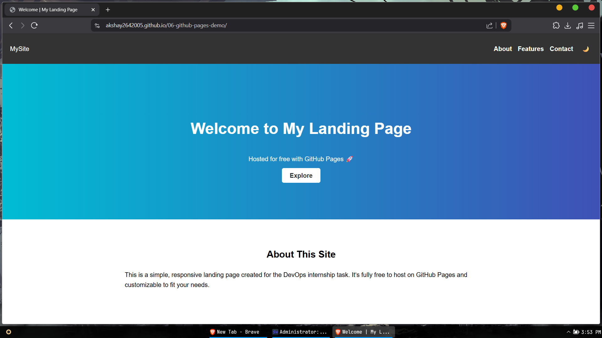

# Landing Page - GitHub Pages Deployment

This is a simple, responsive landing page created as part of the **DevOps Internship Task 6**.  
It is hosted for free using **GitHub Pages**.

## 🚀 Live Website
[🔗 Click here to view](https://akshay2642005.github.io/06-github-pages-demo/)

## 📸 Screenshots
> Replace these placeholders with your actual screenshots after deployment.



## 🛠 Features
- ✅ Clean and responsive design
- ✅ Mobile-friendly
- ✅ Simple HTML, CSS, and JS
- ✅ Dark mode toggle
- ✅ Smooth scrolling
- ✅ Free hosting via GitHub Pages

## ⚙️ Setup & Deployment
1. Clone the repository:
   ```bash
   git clone https://github.com/YOUR-USERNAME/YOUR-REPO-NAME.git
   cd YOUR-REPO-NAME
   ```
2. Edit content as needed.
3. Push changes to GitHub.
4. Enable GitHub Pages in repo settings.

## 📜 License
MIT License
